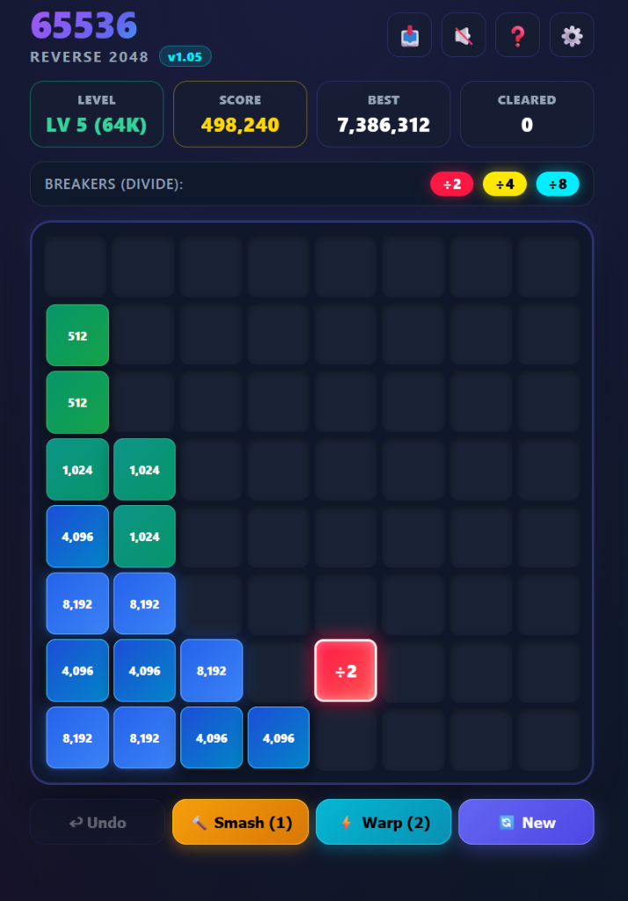

# 65536 — The Reverse 2048 PWA

[](https://srathinagiri.github.io/65536/)
[](https://srathinagiri.github.io/65536/)
[](https://github.com/SRathinaGiri/65536)
[](LICENSE)

An addictive, tactical HTML5 Progressive Web App (PWA) that inverts the iconic **2048** mechanic on its head.

Instead of sliding small tiles together to create larger numbers, **tiles NEVER merge**. You start with a monolithic titan tile and must smash it with high-contrast **breaker tiles** (`÷2`, `÷4`, `÷8`), causing chain reactions and fission until every tile is whittled down to dust and cleared from the board!

---

## 🎮 Play Live Online

### 👉 **[https://srathinagiri.github.io/65536/](https://srathinagiri.github.io/65536/)**

Built strictly as a **Local-First PWA**:
- **Instant Offline Launch**: Loads directly from cache in milliseconds.
- **Zero Network Lag**: No external CDN dependencies; all audio, logic, and graphics are synthesized locally.
- **Background Auto-Update**: Only queries `srathinagiri.github.io/65536` when an active network is detected, notifying you with a 1-tap in-app update button.

---

## 📸 Gameplay Preview & Demo Video

<video src="assets/65536.mp4" controls="controls" muted="muted" width="100%"></video>

> 🎬 **Watch the gameplay demonstration:** [assets/65536.mp4](assets/65536.mp4)



*Shatter 65,536 on an 8×8 grid using strategic breaker collisions, tactical Shatter Hammers, and Breaker Warps!*

---

## 📜 Core Rules & Dynamics

### 1. 🚫 Zero Merging
- **Tiles never combine!** Two numbers touching will not add together (`2048 + 2048` does not become `4096`).
- Breakers do not combine with each other (`2 + 2 ≠ 4`).

### 2. ⚡ The Single Breaker Rule
- Exactly **one breaker tile** exists on the board at a time.
- Swiping sends the breaker sliding across the grid. A new breaker spawns randomly in an empty cell only after the existing breaker is consumed or when starting a turn.

### 3. 💥 Breaker Types & Fission Mechanics

| Breaker | Color | Spawn Rate | Fission Behavior |
| :---: | :---: | :---: | :--- |
| **÷2** | Crimson Red | **75%** | Divides target tile by 2 into **2 equal pieces**. |
| **÷4** | Gold Amber | **15%** | Divides target tile by 4 into **4 pieces** in a cardinal cross formation. |
| **÷8** | Cyan Neon | **10% (BONUS!)** | Detonates target tile into **8 pieces** in a radial 3×3 blast, actively **pushing neighboring tiles outward** into open cells! |

### 4. ✨ Tile Elimination Threshold
- When any target tile is reduced to **16, 8, 4, or 2** ($\le 16$), it shatters into sparkling particles and **completely disappears from the board**.
- **Tier Victory**: Eliminate all target tiles to clear the board and advance to the next level!

### 5. 🎯 Real-Time Move Preview & Consequence HUD
- **Eliminates Hidden Traversal Guesswork**: In 2048, sliding tiles follow strict row/column traversal orders that can make movements hard to anticipate.
- **Always-On Neutral Radar**: Preview lines, blinking elimination targets, and transparent division outcomes are rendered **by default in real-time**—no dragging or aiming required!
- **Blinking Elimination Feedback**: Any target tile guaranteed to be cleared in a given direction **blinks continuously** with a pulsing neon green outline and scale animation, providing unmistakable confirmation that the tile will disappear.
- **Transparent Resultant Division Cells (Ghost Tiles)**: Whenever a direction results in tile division, the exact cells where new pieces land are shown with **50% transparent preview tiles** indicating their directional swipe arrow (`▲`, `▼`, `◀`, `▶`) and predicted number:
  - For **`÷8` Breakers**: Shows all 8 surrounding cells in transparent preview, revealing the full radial explosion pattern!
  - For **`÷4` Breakers**: Shows the 4 cardinal cross pieces in transparent preview.
  - For **`÷2` Breakers**: Shows the twin fragment destination cells.
- **Laser Aiming Beam**: Lines originate at the breaker tile edge and terminate at the destination boundary, keeping breaker numerals (`2`, `4`, `8`, `16`) 100% visible at all times.
- **Consequence Tier Color Coding**:
  - 🟢 **Green (`#00ff66`)**: Guaranteed tile elimination (e.g. `64 ÷ 4 = 16 ➔ 💥 Cleared!`).
  - 🟡 **Amber (`#ffb300`)**: Standard division without overcrowding risk (e.g. `2,048 ÷ 4 = 512 × 4 tiles`).
  - 🔴 **Red (`#ff1744`)**: Dangerous expansion (8/16-piece fission detonations, board occupancy $\ge 85\%$, or $\le 4$ empty cells remaining).
- **Exact Division Equation Badges**: Target lock reticles display the exact arithmetic: `${target} ÷ ${breaker} = ${result} × ${pieces} tiles`.
- **Directional Move Preview Compass HUD**: A 4-way glanceable preview bar above the board reveals consequence tiers and action outcomes for all four swipe directions (`▲`, `▼`, `◀`, `▶`). Tap any chip on mobile to preview its outcome before confirming!
- **Full Keyboard & D-Pad Support**: Hold `Shift + ArrowKey` to preview without moving; hover over on-screen D-Pad buttons for instantaneous path projections.
- **Configurable in Settings**: Easily toggle between full laser targeting, minimal HUD, or standard play.

---

## 🛠️ Tactical Power-Ups

To master higher tiers, two strategic abilities are at your disposal:

### 🔨 Shatter Hammer (≤ 256 Only)
- **Starts with 1 Hammer** by default.
- **Earn +1 Hammer every 25,000 points** scored (and +1 on every campaign level cleared)!
- **Strictly restricted to tiles with values $\le 256$** to prevent trivial random wins and reward calculated division.
- Tap **🔨 Smash** to enter targeting mode: eligible tiles ($\le 256$) glow with a golden border and a `🔨 BREAK` badge, while larger tiles ($> 256$) are protected with `🛡️ IMMUNE`.

### ⚡ Breaker Warp (Earned Every 50,000 Points)
- **Starts with 1 Warp** by default.
- Earn **+1 Warp charge** for every **50,000 points** scored.
- Tap **⚡ Warp** and click any empty cell on the board to instantly teleport the active breaker tile wherever you need it most.

---

## 🏆 Campaign Progression

The game features an escalating campaign spanning powers of 2:

- **Level 1**: **4,096** (Beginner Friendly)
- **Level 2**: **8,192** (Adventurer)
- **Level 3**: **16,384** (Challenger)
- **Level 4**: **32,768** (Master)
- **Level 5**: **65,536** (Grandmaster Titan)

> **Persistent Auto-Save**: Your active board layout, score, hammers, warps, and highest level reached are continuously saved in `localStorage`, so you can close the app and resume right where you left off.

---

## 📲 Installing on Your Device (PWA)

65536 is a Progressive Web App that can be installed on Android, iOS, Windows, Mac, and Linux with full offline capabilities:

### 📱 Android (Chrome / Edge / Firefox)
1. Visit [https://srathinagiri.github.io/65536/](https://srathinagiri.github.io/65536/).
2. Tap the **⚡ Install App** banner at the top, or tap the **📥 Install** icon in the header.
3. Alternatively, open Chrome menu (`⋮`) and select **Install app** or **Add to Home screen**.

### 🍏 iOS (iPhone / iPad Safari)
1. Open [https://srathinagiri.github.io/65536/](https://srathinagiri.github.io/65536/) in Safari.
2. Tap the **Share** button (`⎋`) at the bottom of Safari.
3. Scroll down and tap **Add to Home Screen** (`➕`).

### 💻 Desktop (Chrome / Edge / Brave)
1. Open the page and click the **Install** icon in the browser address bar or the in-game header.
2. Launch 65536 as a standalone, windowed app directly from your desktop or start menu.

---

## ⌨️ Controls

- **Touch / Mobile**: Swipe **Up**, **Down**, **Left**, or **Right** anywhere on the board.
- **Keyboard**:
  - **Arrow Keys** (`↑`, `↓`, `←`, `→`) or **WASD**
  - **Undo**: `Ctrl + Z` or `U`
  - **New Game**: `R` or click **🔄 New**
- **Virtual D-Pad**: Can be toggled ON in Settings (`⚙️`) for one-handed button tapping on mobile devices.

---

## 🔊 Procedural Audio Synthesizer

- Built using the native HTML5 **Web Audio API**.
- Zero external MP3/WAV files: sliding hums, impact strikes, crystal shatters, warp teleports, and victory fanfares are synthesized procedurally in real-time.
- Toggle sound with 1 click using the **🔊 / 🔇** header button or in Settings.

---

## 💻 Local Development

Clone the repository and launch a local HTTP server:

```bash
# 1. Clone repository
git clone https://github.com/SRathinaGiri/65536.git
cd 65536

# 2. Start a local server (any of the following):
# Windows batch script:
run.bat

# Python 3:
python -m http.server 8080

# Node.js npx serve:
npx serve .
```

Open `http://localhost:8080` in your web browser.

---

## 📄 License

Distributed under the [MIT License](LICENSE).
Copyright (c) 2026 SRathinaGiri.
